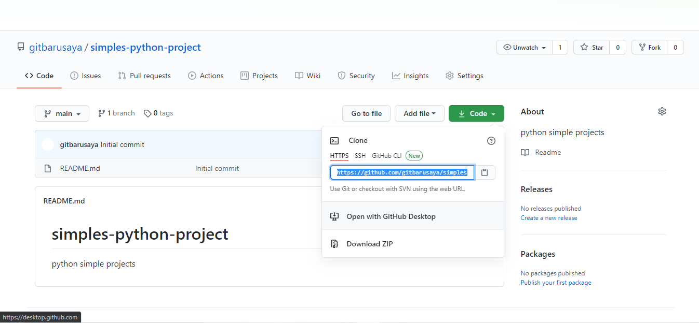

## Persiapan Project dan Clone Project dari  Git

---

### Clone Project dari Git

langkah pertama setelah instalasi pycharm dan git kita akan clone project dari repo

1. klik **get Project** from VCS
3. masukan link repo dari git misalnya github atau gitlab
3. klik **Clone**
4. masukan autentifikasi (*Jika Ada*)
5. Buat Virtualenv (*Sudah Dibuat Secara Otomatis*) langsung Klik **OK**


### Membuat Repositori di Gitlab

sekarang kita akan membuat repositori untuk project kita

pastikan sudah terdaftar di gitlab

1. Klik **Create New Project**
2. Pilih **Create Blank Project**
3. Beri Nama Repo dan Deskripsi lalu klik **Create**


### Instalasi Git bash di Windows 10

setelah melakukan instalasi gitbash pada chapter sebelumnya sekarang kita akan belajar untuk membuat repository

> Note: pastikan sudah mendaftar di akun github


---

### Membuat Repositori Baru di Github


pada chapter ini kita akan belajar bagaimana cara membuat repositori dan `organization` di github, kita mulai dengan cara membuat repositori
berikut caranya

1. Masuk ke Github di situs [https://github.com](https://github.com)
2. Klik **Sign In**
3. Masuk Dengan Email Dan Password yang sudah dibuat
4. Klik **Sign In**
5. Verifikasi Perangkat Dengan Kode Yang Sudah dikirim Melalui Email
6. KLik **Create New**
7. Isi Nama Repo
8. Klik **Initialize With README**
9. Klik **Create**


### Membuat Oganization Baru

setelah sebelumnya bisa membuat repositori baru kali ini kita akan membuat `organization` yang akan kita gunakan untuk manajemen suatu project supaya lebih jelas dan terstuktur
, bagaimana cara buatnya..? berikut langkah-langkanya

1. Pastikan Sudah Login Ke Akun Gihub
2. Klik **New Organization**
3. Pilih Paket Yang Free
4. Beri Nama Pada `Organization` Baru
5. Setup Team
6. Skip Step untuk Melakukan Step
7. Selesaikan Survey
8. Organization Sudah Berhasil Dibuat


Sekarang Organization Sudah Berhasil Dibuat, kita sudah bisa lanjut untuk mulai membuat project


### Membuat Project Python Menggunakan Github & Pycharm

setelah mempersiapkan berbagai hal sekarang kita mulai untuk membuat project dan menyimpanya dalam repositori
dengan akun github yang telah kita buat pada chapter sebelumnya bagian membuat repo dan instalasi git bash pada windows

> untuk MAC OS/OSX bisa install dengan perintah
> ```commandline
> brew install git
> ```

berikut caranya

1. Pastikan Sudah Membuat Repositori Baru Pada Github (*Tutorial ada Pada Chapter Sebelumnya*)
2. Buka Pycharm 
3. lalu pilih `get from VCS` pada Pycharm
4. kemudian buka github atau gitlab tempat repositori baru yang dibuat tadi
5. pilih `Clone` untuk cloning repo dari git





setelah selesai push project ke git kamu dapat melihat perubahanya
git ini di repositori akun kamu.