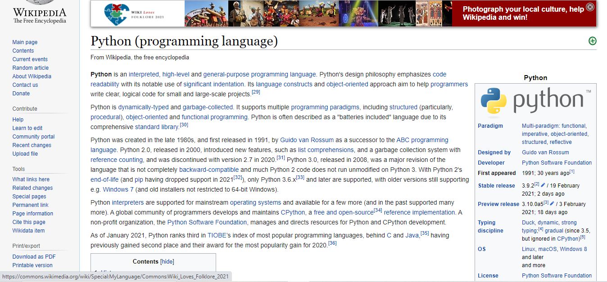
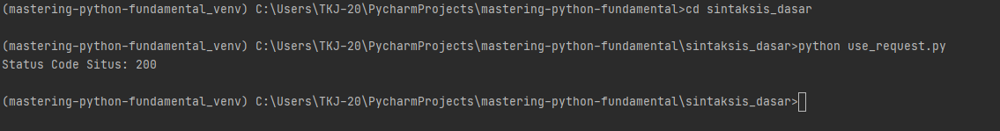

### Menggunakan Modul yang sudah di install menggunakan pip

---

studi kasus menggunakan [requests](https://pypi.org/project/requests/) package ini digunakan untuk melakukan requests ke website
contoh gampangnya seperti membuka browser dan membuka suatu website sebagai contoh kita mau membuka wikipedia dengan url [https://en.wikipedia.org/wiki/Python_(programming_language)](https://en.wikipedia.org/wiki/Python_(programming_language))



kita bisa menggunakan package [requests](https://pypi.org/project/requests/) contoh seperti ini

### Cara Instalasi Paket Menggunakan Pip

cara instalasi modul menggunakan pip 

```python
pip install requests
```

formatnya seperti ini

```python
pip install <nama paket>
```

```python
import requests # <- import modul yang telah diinstall

# contoh penggunaan requests

url = "https://en.wikipedia.org/wiki/Python_(programming_language)"
res = requests.get(url)

# cek status code
print("Status Code Situs: {}".format(res.status_code))

# hasil jika status code 200 maka berhasil

```

hasilnya sebagai berikut



contoh kedua penggunaan *requests* ditambah dengan pengkondisian penerapanya seperti ini

```python
import requests

# contoh penggunaan requests

url = "https://en.wikipedia.org/wiki/Python_(programming_language)"
res = requests.get(url)

# cek status code
if res.status_code != 200:
    print('Error')
else:
    print('Isi Source Code Website wikipedia: ', res.text) # jika status code website adalah 200 maka akan mencetak isi source website

```

jalankan dengan perintah berikut

```commandline
python use_requests_2.py
```

format pemanggilan file python nya seperti ini

> python nama-file.py


> Note: Untuk Mengetahui paket python lainya beserta cara installnya bisa mengunjungi
> website resminya: di [https://pypi.org/](https://pypi.org/)