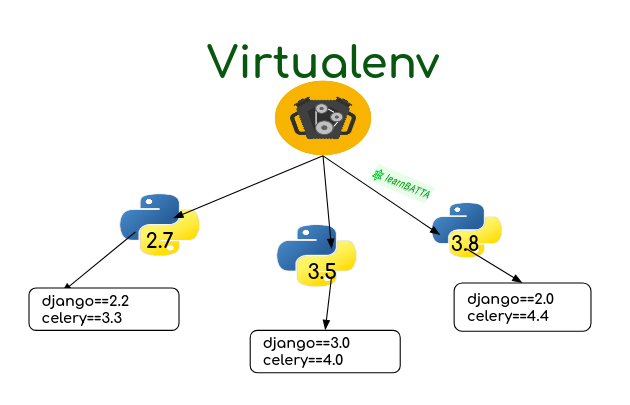
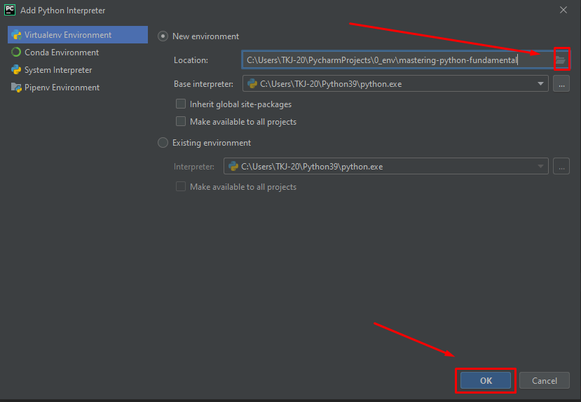
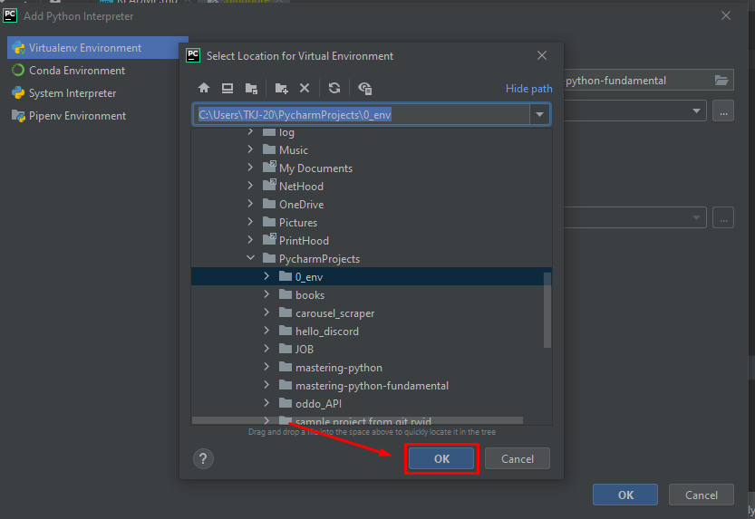
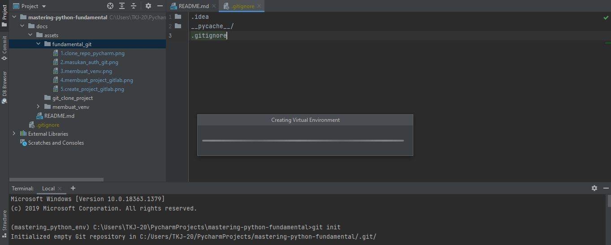
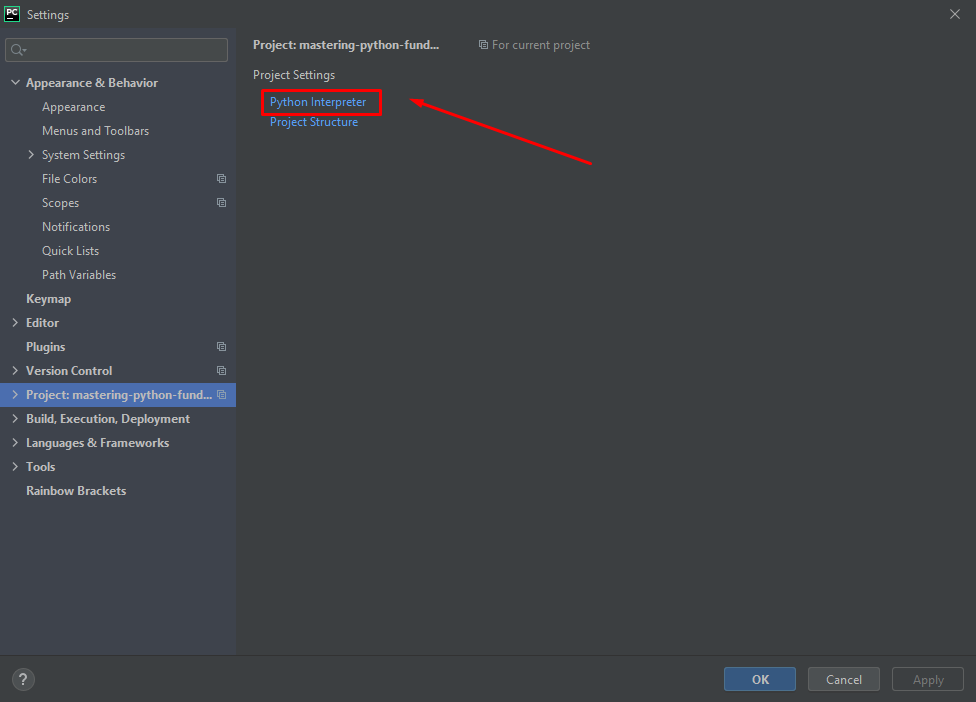
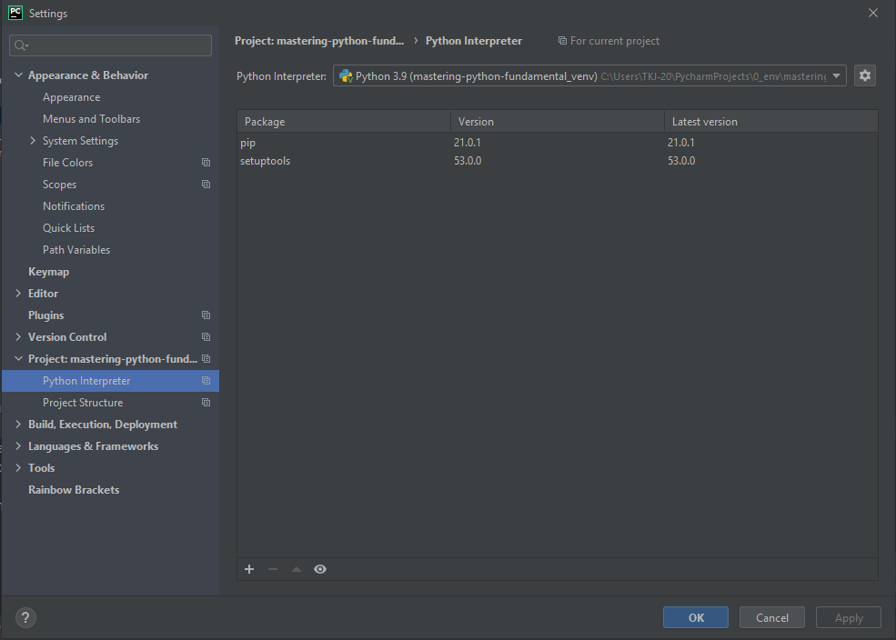

## Membuat Virtual Environtment Menggunakan Pycharm

---

### 1. Konsep Virtual Environtment

membuat daftar paket yang akan diinstall akan sangat penting, hal ini
menjadi sangat penting contohnya ketika kita membuat 2 project yang berbeda, nah kedua project tersebut membutuhkan modul/package yang berbeda
contoh konsepnya seperti gambar dibawah ini



maka dari itu pembuatan Virtual Environtment Hal yang sangat penting dan dapat mempermudah pengerjaan project aplikasi python kita.

### 2. Membuat Virtual Environtment

nah sebelum membuat project python alangkah baiknya kita membuat
virtual environtment untuk mengisolasi python interpreter dan modulnya
berikut cara membuat virtualenv

#### Membuat Virtual Environtment Menggunakan Pycharm

1. Buka Project Python
2. Klik *Python Interpeter*
3. Pilih **Add Interpreter**
4. Klik **New Environtment**
5. Pilih Lokasi Dimana Virtualenv akan dibuat
6. Klik **Ok**








#### Mengaktifkan Virtual Environtment Menggunakan Command Line

kita bisa menggunakan Command Line atau terminal atau CMD berikut contohnya

* **Linux/Mac**

untuk Mac/Linux Bisa Menggunakan Perintah

```commandline
source venv/bin/activate
```

> Dimana `venv` adalah nama virtualenv yang sudah dibuat

comtoh dimana nama virtual environtment yang dibuat adalah `mastering-python_venv`
maka cara mengaktikanya adalah

```bash
source mastering-python_venv/bin/activate
```

cara menonaktifkanya cukup dengan perintah

```commandline
deactivate mastering-python_venv
```

dimana `mastering-python_venv` adalah nama environtment

### 3. Membuat Daftar Modul Python yang sudah Terinstall Menggunakan pip

hal ini berguna ketika kita akan menginstall modul yang dibutuhkan suatu project kita bisa menggunakan perintah

```commandline
pip freeze > requirements.txt
```

contoh outputnya atau contoh isi file `requirements.txt` seperti ini

```requirements.txt
certifi==2020.12.5
chardet==4.0.0
idna==2.10
requests==2.25.1
urllib3==1.26.3
```

atau bisa lihat file `requirements.txt`


### Membuat Virtualenvirontment Menggunakan pycharm

1. Klik **Add interpreter** di Pojok Bagian Bawah
2. Klik **New Environtment**
3. Pastikan Base Interpreter menggunakan Python 3   
4. Pilih Direktori untuk lokasi Membuat Virtual Environtment
5. Klik **Ok**
6. Kemudian Klik **Ok** Untuk Membuat Virtual Environtment


### Cek Virtual environtment Menggunakan Pycharm

1. Klik **Setings**
2. Pilih Menu **Project**
3. Pilih **Python Interpteter**






