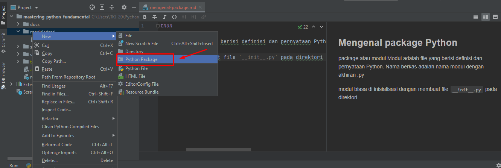
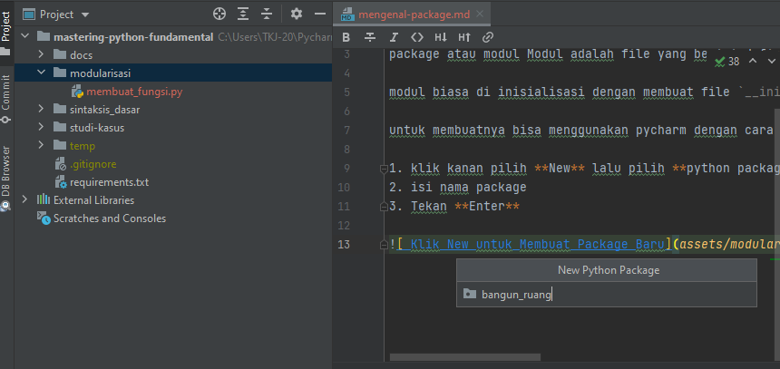

## Mengenal package Python

package atau modul Modul adalah file yang berisi definisi dan pernyataan Python. Nama berkas adalah nama modul dengan akhiran .py

modul biasa di inisialisasi dengan membuat file `__init__.py` pada direktori,

untuk membuatnya bisa menggunakan pycharm dengan cara

1. klik kanan pilih **New** lalu pilih **python package**
2. isi nama package
3. Tekan **Enter**





contoh importnya seperti ini

```python
from bangun_ruang.segitiga import luas_segitiga

# Hitung Luas Segituga

luas_segitiga(10, 15)
```

hasilnya

```python
Luas Segitiga tersebut adalah:  75.0
```